# FarmaGest — Documentación Técnica de Ingeniería de Software
**Sistema Integral de Gestión Farmacéutica y Facturación Electrónica SUNAT / SIRE**

---

## Estructura del Equipo de Trabajo (4 Participantes)

| Participante | Rol / Módulo Responsable | Casos de Uso Asignados |
| :--- | :--- | :--- |
| **Participante 1** | Módulo de Punto de Venta (POS) y Turnos de Caja | • **CUS-01:** Aperturar y Cerrar Caja (Control de Turnos)<br>• **CUS-02:** Registrar Venta y Emitir Comprobante POS (UBL 2.1) |
| **Participante 2** | Módulo de Clientes, RENIEC y Notas de Crédito | • **CUS-03:** Consultar y Registrar Cliente por DNI (RENIEC) / RUC<br>• **CUS-06:** Emitir Nota de Crédito Electrónica y Reingreso Stock |
| **Participante 3** | Módulo de Almacén, Lotes FEFO y Abastecimiento | • **CUS-07:** Controlar Stock con Trazabilidad FEFO y Semáforos<br>• **CUS-08:** Registrar Ingreso de Mercadería y Lotes de Compra |
| **Participante 4** | Módulo de Catálogo, Precios y Tributación SIRE | • **CUS-09:** Gestionar Catálogo y Trazabilidad de Precios<br>• **CUS-10:** Sincronizar y Generar Propuesta SIRE - RVIE SUNAT |

---

## A. Modelo de Requerimiento

### a. Diagrama General de Casos de Uso del Sistema (12 Casos de Uso)

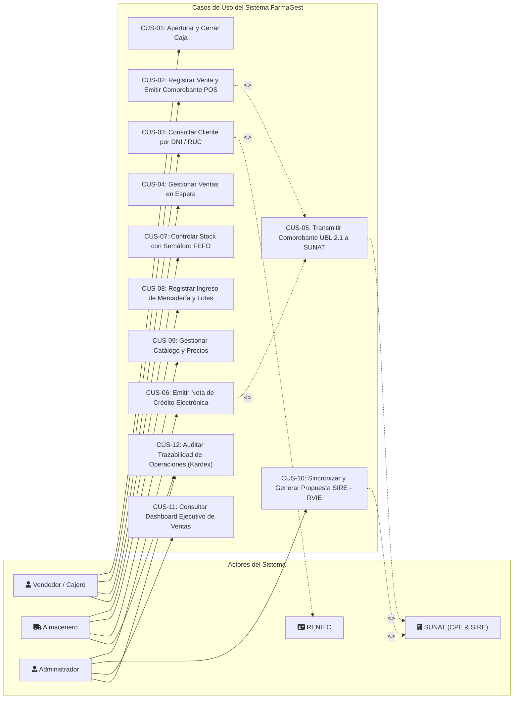
```mermaid
flowchart LR
    subgraph Actores["Actores del Sistema"]
        Vendedor["fa:fa-user Vendedor / Cajero"]
        Almacenero["fa:fa-truck Almacenero"]
        Admin["fa:fa-user-tie Administrador"]
        SUNAT["fa:fa-building SUNAT (CPE & SIRE)"]
        RENIEC["fa:fa-id-card RENIEC"]
    end

    subgraph CasosDeUso["Casos de Uso del Sistema FarmaGest"]
        CU01["CUS-01: Aperturar y Cerrar Caja"]
        CU02["CUS-02: Registrar Venta y Emitir Comprobante POS"]
        CU03["CUS-03: Consultar Cliente por DNI / RUC"]
        CU04["CUS-04: Gestionar Ventas en Espera"]
        CU05["CUS-05: Transmitir Comprobante UBL 2.1 a SUNAT"]
        CU06["CUS-06: Emitir Nota de Crédito Electrónica"]
        CU07["CUS-07: Controlar Stock con Semáforo FEFO"]
        CU08["CUS-08: Registrar Ingreso de Mercadería y Lotes"]
        CU09["CUS-09: Gestionar Catálogo y Precios"]
        CU10["CUS-10: Sincronizar y Generar Propuesta SIRE - RVIE"]
        CU11["CUS-11: Consultar Dashboard Ejecutivo de Ventas"]
        CU12["CUS-12: Auditar Trazabilidad de Operaciones (Kardex)"]
    end

    Vendedor --> CU01
    Vendedor --> CU02
    Vendedor --> CU03
    Vendedor --> CU04

    CU02 -.->|<<include>>| CU05
    CU03 -.->|<<interactúa>>| RENIEC
    CU05 -.->|<<interactúa>>| SUNAT

    Admin --> CU06
    Admin --> CU10
    Admin --> CU11
    Admin --> CU12
    CU06 -.->|<<include>>| CU05
    CU10 -.->|<<interactúa>>| SUNAT

    Almacenero --> CU07
    Almacenero --> CU08
    Almacenero --> CU09
    Almacenero --> CU12
```

---

### b. Especificación de Casos de Uso (2 por Participante = 8 Especificaciones Completas)

---

### [PARTICIPANTE 1]

#### Especificación 1: CUS-01 Aperturar y Cerrar Caja

| Campo | Detalle |
| :--- | :--- |
| **Código** | **CUS-01** |
| **Nombre** | **Aperturar y Cerrar Sesión de Caja (Control de Efectivo y Turnos)** |
| **Actor Principal** | Vendedor / Cajero |
| **Actores Secundarios** | Administrador |
| **Descripción** | Permite registrar el monto inicial en efectivo con el que se inicia un turno de trabajo, registrar las operaciones del día y ejecutar el arqueo/cierre de caja comparando el efectivo real físico contra el saldo calculado por el sistema, registrando diferencias. |
| **Precondiciones** | 1. Usuario autenticado con rol `ROLE_VENDEDOR` o `ROLE_ADMINISTRADOR`.<br>2. Para aperturar: no debe existir una sesión previa abierta para la misma caja física. |
| **Postcondiciones** | 1. Si es apertura: la caja pasa a estado `ABIERTA` y desbloquea el POS.<br>2. Si es cierre: la caja pasa a estado `CERRADA`, se registran sobrantes/faltantes y se emite el comprobante de arqueo. |

##### Flujo Principal
1. El cajero ingresa al módulo de Control de Caja.
2. El sistema detecta que la caja se encuentra cerrada y solicita el monto de apertura (fondo para vueltos).
3. El cajero ingresa el importe (ej. S/ 200.00) y observaciones opcionales.
4. El sistema crea la sesión de caja con estado `ABIERTA`, fecha/hora y habilita las ventas en el POS.
5. Al finalizar el turno, el cajero pulsa "Cerrar Caja".
6. El sistema presenta el resumen de ventas desglosado por medio de pago (Efectivo, Tarjeta, Yape/Plin).
7. El cajero ingresa el conteo de efectivo físico contado en el cajón de dinero.
8. El sistema calcula automáticamente la diferencia (Cuadre perfecto, Sobrante o Faltante).
9. El cajero confirma el cierre; la sesión cambia a estado `CERRADA` y se inhabilita el POS hasta una nueva apertura.

##### Flujos Alternos
* **FA-1 (Diferencia de Dinero):** Si el efectivo físico no coincide con el saldo del sistema, el sistema exige ingresar un motivo justificado en el campo de observaciones antes de permitir el cierre.

##### Captura Funcional (Maqueta POS)
```
+-------------------------------------------------------------------------+
| FARMA OCHENTA - GESTIÓN DE CAJA Y ARQUEO            Turno: CAJA-01      |
|-------------------------------------------------------------------------|
| Estado Actual: [ ABIERTA ]  |  Apertura: S/ 200.00  |  Hora: 08:00 AM   |
| Ventas Efectivo: S/ 350.00  |  Ventas Tarjeta: S/ 220.00 | Yape: S/ 140 |
| Total General en Sistema: S/ 710.00 | Transacciones: 18                 |
|-------------------------------------------------------------------------|
| Conteo Físico en Cajón: [ S/ 550.00  ]                                  |
| (Fondo S/ 200 + Efectivo S/ 350 = Esperado S/ 550.00)                   |
| Diferencia: S/ 0.00 (CUADRE EXACTO)                                     |
| Observaciones: [ Turno mañana finalizado sin novedades               ]  |
|                                                                         |
|                          [ BOTÓN: CERRAR CAJA ]                         |
+-------------------------------------------------------------------------+
```

---

#### Especificación 2: CUS-02 Registrar Venta y Emitir Comprobante POS (UBL 2.1)

| Campo | Detalle |
| :--- | :--- |
| **Código** | **CUS-02** |
| **Nombre** | **Registrar Venta y Emitir Comprobante Electrónico en POS** |
| **Actor Principal** | Vendedor / Cajero |
| **Actores Secundarios** | SUNAT (SOAP `/billService`) |
| **Descripción** | Permite agregar medicamentos al carrito, seleccionar cliente, aplicar descuentos, totalizar con IGV (18%), calcular vuelto, generar el XML UBL 2.1 firmado digitalmente, transmitir a SUNAT, recibir el CDR y generar el ticket impreso térmico con código QR y Hash CPE. |
| **Precondiciones** | 1. Sesión de caja activa en estado `ABIERTA`.<br>2. Stock suficiente en lotes FEFO disponibles. |
| **Postcondiciones** | 1. Venta completada persistida en disco (`backend/data/ventas.json`).<br>2. Stock decrementado en el lote correspondiente.<br>3. Correlativo incrementado automáticamente para la siguiente venta. |

##### Flujo Principal
1. El cajero visualiza en el POS el próximo correlativo oficial (ej. `B001-00000005`).
2. Agrega los productos mediante código de barras o búsqueda rápida.
3. El sistema valida stock y presenta el lote con vencimiento más próximo (FEFO).
4. El cajero selecciona el tipo de comprobante: `BOLETA` o `FACTURA`.
5. Si el cliente requiere comprobante nominal, digita su DNI/RUC.
6. Selecciona el medio de pago (`EFECTIVO`, `TARJETA`, `YAPE/PLIN` o `CREDITO`).
7. El cajero presiona "Completar Venta".
8. El backend genera el XML bajo la norma UBL 2.1, lo firma con el certificado tributario y lo envía a SUNAT.
9. SUNAT emite el CDR de aceptación (Código 0).
10. El sistema muestra el modal con el ticket impreso, el código QR y el Hash CPE oficial.

##### Flujos Alternos
* **FA-1 (Venta rápida menor a S/ 700 sin DNI):** Se asigna automáticamente a `CLIENTE VARIOS` (DNI `00000000`).
* **FA-2 (Falla temporal de red / SUNAT lenta):** Si SUNAT no responde en 35 segundos, el sistema marca el comprobante como `PENDIENTE_ENVIO` en contingencia y emite el ticket físico para no retrasar la atención.

##### Captura Funcional (Maqueta POS)
```
+-------------------------------------------------------------------------+
| POS FARMA OCHENTA                                 Próximo: B001-00000005|
| [ Escanear / Buscar producto... ]                 Turno: CAJA-01        |
|-------------------------------------------------------------------------|
| 1 x Paracetamol 500 mg (Lote: L-2024-PAR, Vcto: 30/06/2027) -> S/ 0.50  |
| 1 x Ibuprofeno 400 mg  (Lote: L-2024-IBU1, Vcto: 15/11/2026) -> S/ 0.90 |
|-------------------------------------------------------------------------|
| Cliente: 73457758 - DIEGO GABRIEL ALTAMIRANO MASIAS                     |
| Tipo: [X] BOLETA   [ ] FACTURA    Medio: [X] EFECTIVO  [ ] YAPE/PLIN    |
| Subtotal: S/ 1.19 | IGV (18%): S/ 0.21 | Total: S/ 1.40                 |
| Recibido: S/ 2.00 | Vuelto: S/ 0.60                                     |
|                                                                         |
|                [ BOTÓN: COMPLETAR VENTA & TRANSMITIR ]                  |
+-------------------------------------------------------------------------+
```

---

### [PARTICIPANTE 2]

#### Especificación 3: CUS-03 Consultar y Registrar Cliente por DNI (RENIEC) / RUC (SUNAT)

| Campo | Detalle |
| :--- | :--- |
| **Código** | **CUS-03** |
| **Nombre** | **Consultar y Registrar Cliente por DNI (RENIEC) / RUC (SUNAT)** |
| **Actor Principal** | Vendedor / Cajero |
| **Actores Secundarios** | RENIEC (API REST), SUNAT (Padrón RUC) |
| **Descripción** | Permite consultar en tiempo real los nombres y apellidos de una persona natural ante RENIEC mediante su número de DNI de 8 dígitos, o la razón social y dirección fiscal de una persona jurídica mediante su RUC de 11 dígitos, registrando o actualizando su ficha de cliente. |
| **Precondiciones** | Conexión activa a internet para acceder a los endpoints gubernamentales. |
| **Postcondiciones** | Cliente guardado en la base de datos de clientes con sus datos oficiales validados. |

##### Flujo Principal
1. En el módulo POS o en el catálogo de clientes, el usuario selecciona el tipo de documento (`DNI` o `RUC`).
2. Digita los 8 dígitos del DNI o los 11 dígitos del RUC y pulsa el botón "Consultar".
3. El sistema valida el formato numérico y envía la petición al servicio de consulta externa.
4. El servicio externo responde con la identidad oficial (Ej: `YANETT CHAVEZ LEZCANO` o `BOTICA POPULAR SAC`).
5. El sistema autocompleta los campos de Nombres / Razón Social y Dirección sin errores tipográficos.
6. El cliente queda vinculado inmediatamente para la emisión del comprobante electrónico.

##### Flujos Alternos
* **FA-1 (DNI no encontrado o caducado):** Si el servicio retorna error 404, se notifica en pantalla y se permite el ingreso manual de los datos.

##### Captura Funcional (Maqueta Búsqueda)
```
+-------------------------------------------------------------------------+
| DATOS DEL CLIENTE PARA FACTURACIÓN ELECTRÓNICA                          |
|-------------------------------------------------------------------------|
| Tipo Doc: [ DNI  v ]   Número: [ 09189262 ]   [ BOTÓN: BUSCAR RENIEC ]  |
| Estado: ✔ RENIEC: Documento verificado exitosamente                     |
| Nombre / Razón Social: [ YANETT CHAVEZ LEZCANO                        ] |
| Dirección Fiscal:      [ Lima, Perú                                   ] |
| Teléfono: [ 987654321 ]   Email: [ yanett.chavez@email.com            ] |
| Línea de Crédito: S/ 200.00 | Días Crédito: 15 días                     |
+-------------------------------------------------------------------------+
```

---

#### Especificación 4: CUS-06 Emitir Nota de Crédito Electrónica y Reingreso de Stock

| Campo | Detalle |
| :--- | :--- |
| **Código** | **CUS-06** |
| **Nombre** | **Emitir Nota de Crédito Electrónica (SUNAT Tipo 07) y Reingreso de Stock** |
| **Actor Principal** | Administrador |
| **Actores Secundarios** | SUNAT (SOAP `/billService`) |
| **Descripción** | Permite anular una venta total o parcialmente, emitiendo la Nota de Crédito electrónica serie `BC01`, notificando a SUNAT, devolviendo el dinero al cliente y retornando las unidades al stock del lote correspondiente con asiento en Kardex. |
| **Precondiciones** | El comprobante original (Boleta/Factura) debe estar registrado en el sistema. |
| **Postcondiciones** | 1. La venta original pasa a estado `ANULADA` o `CON_NOTA_CREDITO`.<br>2. Se genera el comprobante `BC01-00000001` con CDR aceptado.<br>3. Se incrementa el inventario y se refleja con signo negativo en el SIRE. |

##### Flujo Principal
1. El Administrador busca el comprobante original a modificar (ej. `B001-00000003`).
2. El sistema despliega los ítems vendidos, cantidades y lote de origen.
3. El Administrador selecciona el código de motivo SUNAT (Tipo 01: Anulación de la operación / Tipo 07: Devolución por ítem).
4. Ingresa el sustento obligatorio (ej: "Devolución de medicamento por receta modificada").
5. Confirma la emisión de la Nota de Crédito.
6. El microservicio PHP genera el XML UBL 2.1 de Nota de Crédito, lo firma y lo transmite a SUNAT.
7. SUNAT valida y devuelve la constancia CDR aceptada.
8. El sistema reingresa los medicamentos al lote físico original y registra el movimiento en el Kardex.

##### Captura Funcional (Maqueta Nota de Crédito)
```
+-------------------------------------------------------------------------+
| EMISIÓN DE NOTA DE CRÉDITO ELECTRÓNICA (CATÁLOGO SUNAT 09)             |
|-------------------------------------------------------------------------|
| Comprobante Modificado: BOLETA B001-00000003  | Fecha: 28/10/2026       |
| Cliente: 09189262 - YANETT CHAVEZ LEZCANO                               |
|-------------------------------------------------------------------------|
| Tipo Nota de Crédito: [ 01 - Anulación de la operación                v]|
| Sustento / Motivo:    [ Devolución de comprobante B001-3 por cambio    ]|
| Ítem a Devolver: 1x Ibuprofeno 400 mg (Lote: L-2024-IBU1) -> S/ 0.90    |
| Reingresar al stock físico: [X] SÍ (Lote L-2024-IBU1 + 1 unidad)        |
| Reembolso al Cliente: S/ 0.90 en Efectivo                               |
|                                                                         |
|                [ BOTÓN: TRANSMITIR NOTA DE CRÉDITO A SUNAT ]            |
+-------------------------------------------------------------------------+
```

---

### [PARTICIPANTE 3]

#### Especificación 5: CUS-07 Controlar Stock con Trazabilidad FEFO y Semáforos

| Campo | Detalle |
| :--- | :--- |
| **Código** | **CUS-07** |
| **Nombre** | **Controlar Stock con Trazabilidad de Lotes y Semáforo FEFO** |
| **Actor Principal** | Almacenero / Vendedor |
| **Actores Secundarios** | Ninguno |
| **Descripción** | Permite supervisar las existencias por medicamento desglosadas por lote de fabricación, calculando los días restantes hasta la fecha de caducidad e identificando el riesgo con semaforización cromática para evitar mermas por medicamentos vencidos. |
| **Precondiciones** | Existencia de lotes registrados en el sistema. |
| **Postcondiciones** | Priorización de dispensación en POS según la regla First Expired, First Out. |

##### Flujo Principal
1. El usuario accede al módulo de Inventario y Lotes.
2. El sistema calcula en tiempo real la diferencia entre la fecha de caducidad y la fecha actual del sistema.
3. Se asigna la categoría del semáforo:
   * **ROJO (Crítico):** Vencimiento en menos de 30 días.
   * **AMARILLO (Alerta):** Vencimiento entre 30 y 90 días.
   * **VERDE (Óptimo):** Vencimiento mayor a 90 días.
4. El almacenero filtra por lotes en riesgo para programar promociones de rotación rápida o devoluciones al proveedor.

##### Captura Funcional (Maqueta Inventario FEFO)
```
+-------------------------------------------------------------------------+
| CONTROL DE INVENTARIO - TRAZABILIDAD FEFO           Sucursal: Ate 01    |
|-------------------------------------------------------------------------|
| Producto             | Lote        | Vencimiento | Días | Stock | Estado|
| Ibuprofeno 400 mg    | L-2024-IBU1 | 15/11/2026  | 15 d |  29 un| [ROJO]|
| Amoxicilina 500 mg   | L-2024-AMX  | 08/12/2026  | 38 d |   8 un| [AMAR]|
| Omeprazol 20 mg      | L-2024-OME  | 08/01/2027  | 69 d |  40 un| [AMAR]|
| Paracetamol 500 mg   | L-2024-PAR  | 30/06/2027  | 607d |  49 un| [VERD]|
| Alcohol 70° 250 ml   | L-2026-ALC  | 14/10/2028  |1079d | 200 un| [VERD]|
+-------------------------------------------------------------------------+
```

---

#### Especificación 6: CUS-08 Registrar Ingreso de Mercadería y Lotes de Compra

| Campo | Detalle |
| :--- | :--- |
| **Código** | **CUS-08** |
| **Nombre** | **Registrar Ingreso de Mercadería y Lotes de Compra** |
| **Actor Principal** | Almacenero |
| **Actores Secundarios** | Proveedor (Droguería) |
| **Descripción** | Permite recepcionar la mercadería enviada por droguerías o laboratorios asociada a una Orden de Compra previa, registrando el número de guía de remisión, factura de compra, número de lote físico, fecha de vencimiento y costo unitario pactado. |
| **Precondiciones** | Orden de compra en estado `APROBADA`. |
| **Postcondiciones** | Incremento del stock disponible y creación del nuevo registro de lote FEFO. |

##### Flujo Principal
1. El almacenero selecciona la Orden de Compra pendiente (ej. `OC-2026-0001` de Droguería Los Andes).
2. Ingresa los números de comprobante del proveedor: Factura Proveedor y Guía de Remisión.
3. Para cada medicamento recibido, verifica físicamente el blíster o frasco y digita el número de lote y fecha de vencimiento.
4. Ingresa las cantidades recibidas y constata que no existan medicamentos dañados.
5. Presiona "Registrar Ingreso Físico".
6. El sistema crea los nuevos registros en la tabla de lotes y actualiza el Kardex de entradas.

##### Captura Funcional (Maqueta Recepción de Compra)
```
+-------------------------------------------------------------------------+
| RECEPCIÓN DE MERCADERÍA - INGRESO A ALMACÉN       Orden: OC-2026-0001   |
| Proveedor: 20100055230 - Droguería Los Andes S.A.C.                     |
| Factura Prov: [ F001-0002130 ]     Guía Remisión: [ GR-001-000452     ]|
|-------------------------------------------------------------------------|
| Medicamento        | Cant. Pedida | Cant. Recibida | Nro. Lote  | Vcto  |
| Amoxicilina 500 mg |     50 un    |     50 un      | L-2026-AMX |12/2028|
| Ibuprofeno 400 mg  |    100 un    |    100 un      | L-2026-IBU |08/2028|
|                                                                         |
|                 [ BOTÓN: CONFIRMAR INGRESO AL INVENTARIO ]              |
+-------------------------------------------------------------------------+
```

---

### [PARTICIPANTE 4]

#### Especificación 7: CUS-09 Gestionar Catálogo y Trazabilidad de Precios

| Campo | Detalle |
| :--- | :--- |
| **Código** | **CUS-09** |
| **Nombre** | **Gestionar Catálogo de Medicamentos y Trazabilidad de Precios** |
| **Actor Principal** | Administrador / Almacenero |
| **Actores Secundarios** | DIGEMID (Control de Principios Activos) |
| **Descripción** | Permite crear, modificar y categorizar productos farmacéuticos (principio activo, presentación, laboratorio, condición de venta con/sin receta) y auditar el historial de variaciones de precios de costo y venta calculando el margen comercial. |
| **Precondiciones** | Permiso `PRODUCTO_CREAR` o `PRODUCTO_PRECIO_CAMBIAR`. |
| **Postcondiciones** | Producto disponible en POS con precio actualizado y registro inmutable en el historial. |

##### Flujo Principal
1. El usuario accede al Catálogo de Productos.
2. Selecciona un medicamento o pulsa "Nuevo Producto".
3. Define los atributos farmacéuticos: Principio Activo, Concentración, Presentación, Laboratorio y Categoría.
4. Establece el precio de costo de adquisición y el precio de venta al público.
5. El sistema calcula en vivo el porcentaje de margen de utilidad neta.
6. Si se modifica un precio existente, el sistema solicita un motivo obligatorio (ej. "Ajuste anual del laboratorio").
7. Guarda los cambios; el sistema actualiza el catálogo y genera el registro en la tabla de trazabilidad de precios.

##### Captura Funcional (Maqueta Catálogo)
```
+-------------------------------------------------------------------------+
| EDICIÓN DE MEDICAMENTO Y REGISTRO DE PRECIOS                           |
|-------------------------------------------------------------------------|
| Código Barras: [ 7751234567890 ]   Nombre: [ Paracetamol 500 mg       ] |
| Principio Activo: [ Paracetamol ]  Concentración: [ 500 mg            ] |
| Presentación: [ Tableta        ]   Laboratorio:   [ Laboratorios Portugal|
| Requiere Receta Médica: [ ] SÍ   [X] NO (Venta Libre)                   |
|-------------------------------------------------------------------------|
| Precio Costo: S/ 0.22  |  Precio Venta: S/ 0.50  | Margen: 56.0%        |
| Motivo del Cambio de Precio: [ Ajuste por inflación anual Medifarma   ] |
|                                                                         |
|                          [ BOTÓN: GUARDAR CAMBIOS ]                     |
+-------------------------------------------------------------------------+
```

---

#### Especificación 8: CUS-10 Sincronizar y Generar Propuesta SIRE - RVIE SUNAT

| Campo | Detalle |
| :--- | :--- |
| **Código** | **CUS-10** |
| **Nombre** | **Sincronizar y Generar Propuesta SIRE - RVIE SUNAT** |
| **Actor Principal** | Administrador |
| **Actores Secundarios** | SUNAT (API REST SIRE OAuth 2.0) |
| **Descripción** | Permite consolidar todas las operaciones de venta del mes fiscal activo, calcular el débito fiscal de IGV, estructurar los Códigos de Anotación de Registro (CAR) de 27 dígitos y generar el archivo plano oficial de intercambio `LE1073457758320261000140400021111.txt` para su macro en el portal Clave SOL. |
| **Precondiciones** | Ventas emitidas y persistidas en el período seleccionado. |
| **Postcondiciones** | Archivo oficial TXT y CSV descargado con la estructura reglamentaria de SUNAT. |

##### Flujo Principal
1. El Administrador accede a **Reportes ➔ SIRE (RVIE)**.
2. Selecciona el período tributario (ej. `202610`).
3. El sistema carga automáticamente las ventas emitidas desde `backend/data/ventas.json`.
4. El sistema consolida la información y calcula:
   * Total Comprobantes emitidos.
   * Total Base Imponible Gravada.
   * Total Débito Fiscal IGV.
   * Total Importe Facturado.
5. El Administrador puede pulsar "Sincronizar en Vivo con SUNAT SIRE" para verificar la conexión OAuth 2.0.
6. Pulsa "Descargar TXT Oficial SIRE (RVIE)".
7. El navegador descarga el archivo con nomenclatura oficial listo para ser subido al portal de SUNAT.

##### Captura Funcional (Maqueta Reporte SIRE)
```
+-------------------------------------------------------------------------+
| SISTEMA INTEGRADO DE REGISTROS ELECTRÓNICOS (SIRE) - RVIE               |
| Período: [ 202610 v ]  RUC Emisor: 10734577583 - ALTAMIRANO MASIAS DIEGO|
| Estado Conexión SUNAT: ✔ CONECTADO EN VIVO (OAuth 2.0 Token Activo)     |
|-------------------------------------------------------------------------|
| Comprobantes: 5  | BI Gravada: S/ 2.70 | IGV: S/ 0.50 | Total: S/ 3.20  |
|-------------------------------------------------------------------------|
| Tipo CP | Serie-Número | Fecha      | Doc Cliente | Razón Social| Total |
| 03      | B001-1       | 28/10/2026 | 00000000    | VARIOS      | S/0.90|
| 03      | B001-2       | 28/10/2026 | 00000000    | VARIOS      | S/0.90|
| 03      | B001-3       | 28/10/2026 | 09189262    | YANETT CH.  | S/0.90|
| 07 (NC) | BC01-1       | 28/10/2026 | 09189262    | YANETT CH.  |-S/0.90|
| 03      | B001-4       | 29/10/2026 | 00000000    | VARIOS      | S/0.50|
|-------------------------------------------------------------------------|
| [ DESCARGAR TXT SIRE RVIE ]        [ DESCARGAR REPORTE EXCEL / CSV ]    |
+-------------------------------------------------------------------------+
```

---

## B. Modelo de Análisis y Diseño (Estilo IBM Rational Rhapsody)

> [!NOTE]
> **Normativa de Diagramas de Clases de Análisis según IBM Rational Rhapsody:**
> En Rational Rhapsody, los diagramas de clases de análisis implementan el patrón **BCE (Boundary - Control - Entity)** según el estándar RUP / UML:
> 1. **`<<boundary>>` (Clases Límite / Interfaz):** Representan la frontera entre el actor y el sistema (pantallas, modales, lectores o clientes de APIs externas). En Rhapsody reciben eventos del usuario y delegan hacia los controladores.
> 2. **`<<control>>` (Clases de Control / Gestores):** Encapsulan la lógica de negocio y las reglas de orquestación de cada Caso de Uso. Coordinan transacciones, validaciones y cálculos.
> 3. **`<<entity>>` (Clases de Entidad / Datos):** Representan la información del dominio del negocio que persiste en el sistema con sus relaciones de composición (`*--`) y asociación (`-->`).
> 4. **Reglas de Robustez:** Una clase `<<boundary>>` **nunca** se comunica directamente con una `<<entity>>`; siempre se canaliza a través de un `<<control>>`. Todas las asociaciones cuentan con multiplicidades (`1`, `0..1`, `1..*`) y nombres de rol.

---

### a. Realización de Casos de Uso Core (2 por Participante = 8 Realizaciones)

---

### [PARTICIPANTE 1]

#### 1. Realización CUS-01: Aperturar y Cerrar Caja

##### i. Diagrama de Clases de Análisis (Estilo Rhapsody)
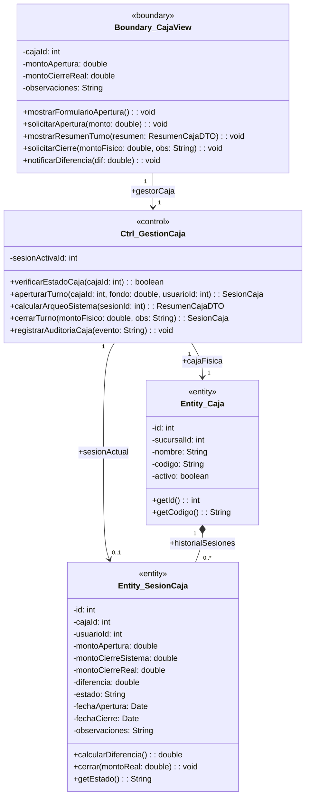
```mermaid
classDiagram
    class Boundary_CajaView <<boundary>> {
        -cajaId: int
        -montoApertura: double
        -montoCierreReal: double
        -observaciones: String
        +mostrarFormularioApertura() : void
        +solicitarApertura(monto: double) : void
        +mostrarResumenTurno(resumen: ResumenCajaDTO) : void
        +solicitarCierre(montoFisico: double, obs: String) : void
        +notificarDiferencia(dif: double) : void
    }

    class Ctrl_GestionCaja <<control>> {
        -sesionActivaId: int
        +verificarEstadoCaja(cajaId: int) : boolean
        +aperturarTurno(cajaId: int, fondo: double, usuarioId: int) : SesionCaja
        +calcularArqueoSistema(sesionId: int) : ResumenCajaDTO
        +cerrarTurno(montoFisico: double, obs: String) : SesionCaja
        +registrarAuditoriaCaja(evento: String) : void
    }

    class Entity_Caja <<entity>> {
        -id: int
        -sucursalId: int
        -nombre: String
        -codigo: String
        -activo: boolean
        +getId() : int
        +getCodigo() : String
    }

    class Entity_SesionCaja <<entity>> {
        -id: int
        -cajaId: int
        -usuarioId: int
        -montoApertura: double
        -montoCierreSistema: double
        -montoCierreReal: double
        -diferencia: double
        -estado: String
        -fechaApertura: Date
        -fechaCierre: Date
        -observaciones: String
        +calcularDiferencia() : double
        +cerrar(montoReal: double) : void
        +getEstado() : String
    }

    Boundary_CajaView "1" --> "1" Ctrl_GestionCaja : +gestorCaja
    Ctrl_GestionCaja "1" --> "1" Entity_Caja : +cajaFisica
    Ctrl_GestionCaja "1" --> "0..1" Entity_SesionCaja : +sesionActual
    Entity_Caja "1" *-- "0..*" Entity_SesionCaja : +historialSesiones
```

##### ii. Diagrama de Comunicación
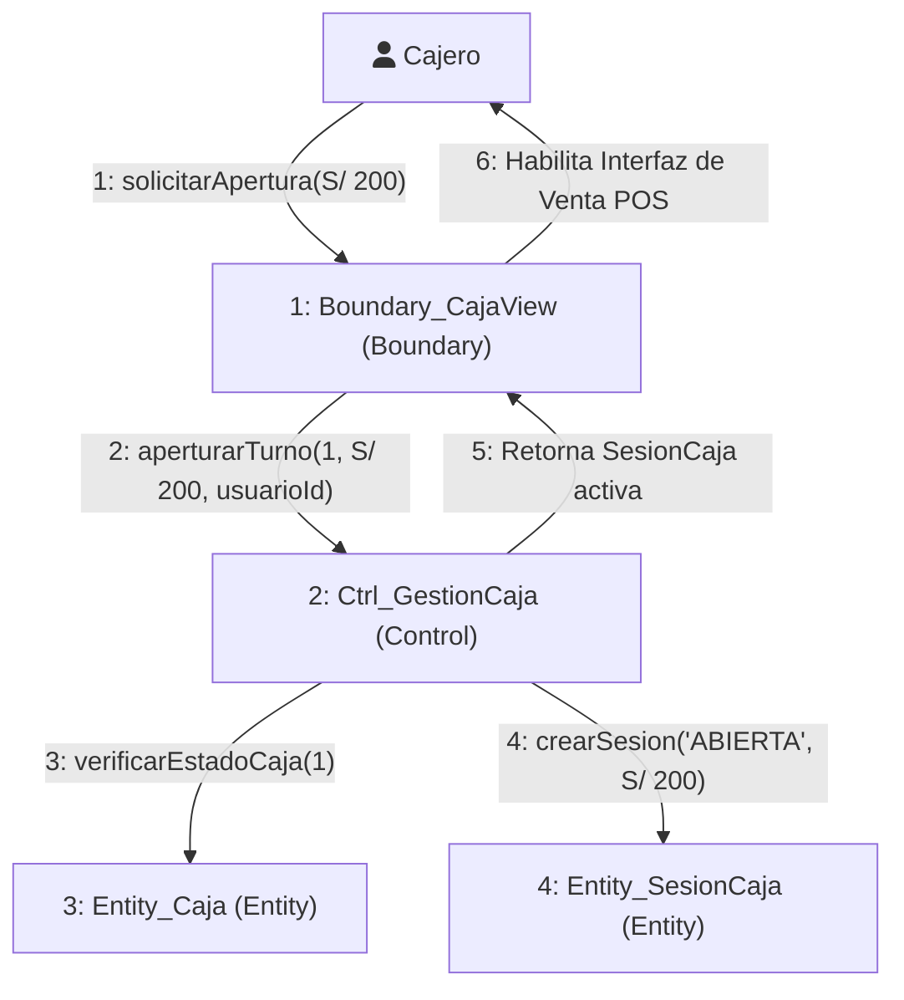
```mermaid
flowchart TD
    Cajero["fa:fa-user Cajero"]
    Boundary["1: Boundary_CajaView (Boundary)"]
    Control["2: Ctrl_GestionCaja (Control)"]
    EntityCaja["3: Entity_Caja (Entity)"]
    EntitySesion["4: Entity_SesionCaja (Entity)"]

    Cajero -->|"1: solicitarApertura(S/ 200)"| Boundary
    Boundary -->|"2: aperturarTurno(1, S/ 200, usuarioId)"| Control
    Control -->|"3: verificarEstadoCaja(1)"| EntityCaja
    Control -->|"4: crearSesion('ABIERTA', S/ 200)"| EntitySesion
    Control -->|"5: Retorna SesionCaja activa"| Boundary
    Boundary -->|"6: Habilita Interfaz de Venta POS"| Cajero
```

---

#### 2. Realización CUS-02: Registrar Venta y Emitir Comprobante POS (UBL 2.1)

##### i. Diagrama de Clases de Análisis (Estilo Rhapsody)
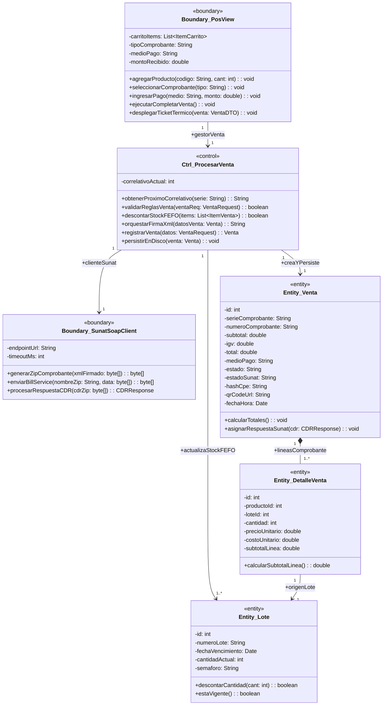
```mermaid
classDiagram
    class Boundary_PosView <<boundary>> {
        -carritoItems: List~ItemCarrito~
        -tipoComprobante: String
        -medioPago: String
        -montoRecibido: double
        +agregarProducto(codigo: String, cant: int) : void
        +seleccionarComprobante(tipo: String) : void
        +ingresarPago(medio: String, monto: double) : void
        +ejecutarCompletarVenta() : void
        +desplegarTicketTermico(venta: VentaDTO) : void
    }

    class Boundary_SunatSoapClient <<boundary>> {
        -endpointUrl: String
        -timeoutMs: int
        +generarZipComprobante(xmlFirmado: byte[]) : byte[]
        +enviarBillService(nombreZip: String, data: byte[]) : byte[]
        +procesarRespuestaCDR(cdrZip: byte[]) : CDRResponse
    }

    class Ctrl_ProcesarVenta <<control>> {
        -correlativoActual: int
        +obtenerProximoCorrelativo(serie: String) : String
        +validarReglasVenta(ventaReq: VentaRequest) : boolean
        +descontarStockFEFO(items: List~ItemVenta~) : boolean
        +orquestarFirmaXml(datosVenta: Venta) : String
        +registrarVenta(datos: VentaRequest) : Venta
        +persistirEnDisco(venta: Venta) : void
    }

    class Entity_Venta <<entity>> {
        -id: int
        -serieComprobante: String
        -numeroComprobante: String
        -subtotal: double
        -igv: double
        -total: double
        -medioPago: String
        -estado: String
        -estadoSunat: String
        -hashCpe: String
        -qrCodeUrl: String
        -fechaHora: Date
        +calcularTotales() : void
        +asignarRespuestaSunat(cdr: CDRResponse) : void
    }

    class Entity_DetalleVenta <<entity>> {
        -id: int
        -productoId: int
        -loteId: int
        -cantidad: int
        -precioUnitario: double
        -costoUnitario: double
        -subtotalLinea: double
        +calcularSubtotalLinea() : double
    }

    class Entity_Lote <<entity>> {
        -id: int
        -numeroLote: String
        -fechaVencimiento: Date
        -cantidadActual: int
        -semaforo: String
        +descontarCantidad(cant: int) : boolean
        +estaVigente() : boolean
    }

    Boundary_PosView "1" --> "1" Ctrl_ProcesarVenta : +gestorVenta
    Ctrl_ProcesarVenta "1" --> "1" Boundary_SunatSoapClient : +clienteSunat
    Ctrl_ProcesarVenta "1" --> "1" Entity_Venta : +creaYPersiste
    Ctrl_ProcesarVenta "1" --> "1..*" Entity_Lote : +actualizaStockFEFO
    Entity_Venta "1" *-- "1..*" Entity_DetalleVenta : +lineasComprobante
    Entity_DetalleVenta "1" --> "1" Entity_Lote : +origenLote
```

> [!TIP]
> **Captura Visual Renderizada (Estilo IBM Rational Rhapsody Developer):**
> 
> 

##### ii. Diagrama de Comunicación
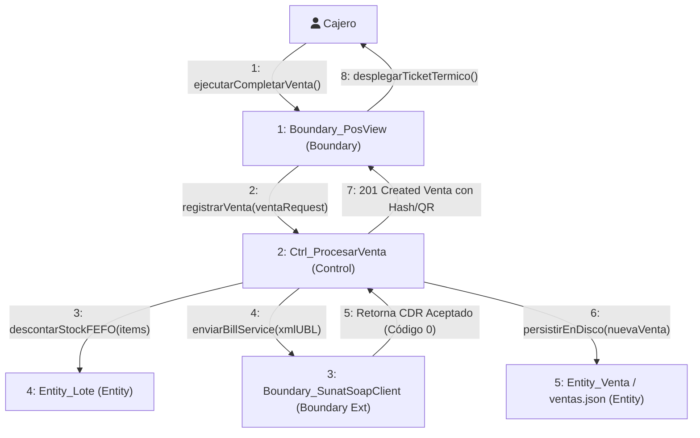
```mermaid
flowchart TD
    Cajero["fa:fa-user Cajero"]
    BoundaryPOS["1: Boundary_PosView (Boundary)"]
    ControlVenta["2: Ctrl_ProcesarVenta (Control)"]
    BoundarySunat["3: Boundary_SunatSoapClient (Boundary Ext)"]
    EntityLote["4: Entity_Lote (Entity)"]
    EntityVenta["5: Entity_Venta / ventas.json (Entity)"]

    Cajero -->|"1: ejecutarCompletarVenta()"| BoundaryPOS
    BoundaryPOS -->|"2: registrarVenta(ventaRequest)"| ControlVenta
    ControlVenta -->|"3: descontarStockFEFO(items)"| EntityLote
    ControlVenta -->|"4: enviarBillService(xmlUBL)"| BoundarySunat
    BoundarySunat -->|"5: Retorna CDR Aceptado (Código 0)"| ControlVenta
    ControlVenta -->|"6: persistirEnDisco(nuevaVenta)"| EntityVenta
    ControlVenta -->|"7: 201 Created Venta con Hash/QR"| BoundaryPOS
    BoundaryPOS -->|"8: desplegarTicketTermico()"| Cajero
```

> [!TIP]
> **Captura Visual Renderizada (Estilo IBM Rational Rhapsody Developer):**
> 
> 

---

### [PARTICIPANTE 2]

#### 3. Realización CUS-03: Consultar Cliente por DNI (RENIEC) / RUC (SUNAT)

##### i. Diagrama de Clases de Análisis (Estilo Rhapsody)
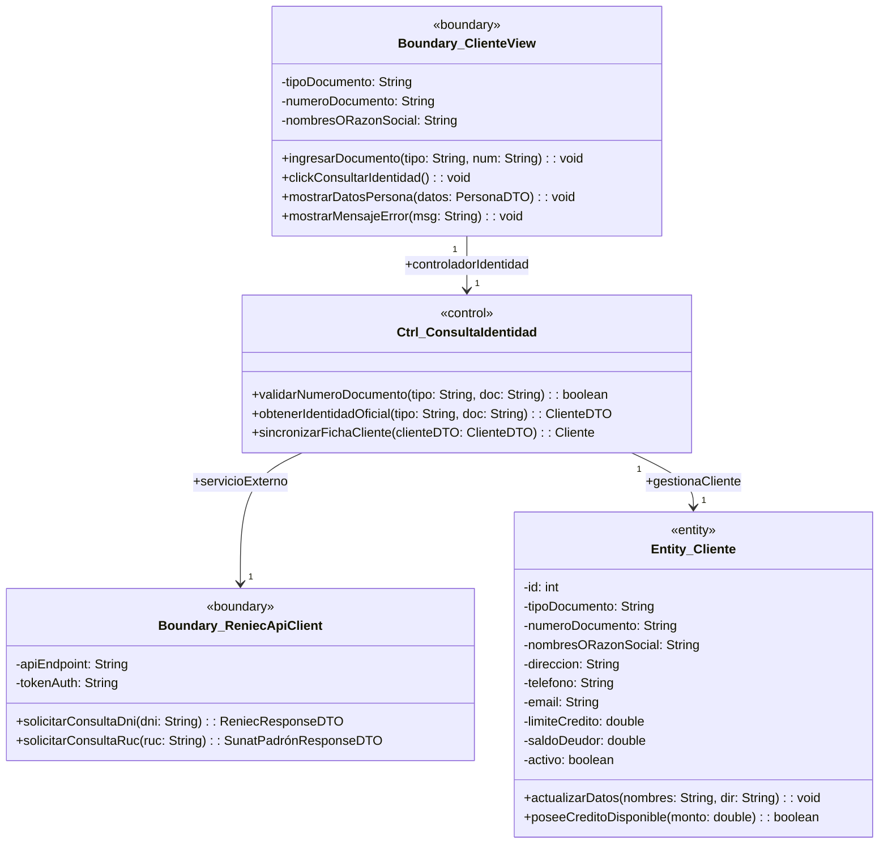
```mermaid
classDiagram
    class Boundary_ClienteView <<boundary>> {
        -tipoDocumento: String
        -numeroDocumento: String
        -nombresORazonSocial: String
        +ingresarDocumento(tipo: String, num: String) : void
        +clickConsultarIdentidad() : void
        +mostrarDatosPersona(datos: PersonaDTO) : void
        +mostrarMensajeError(msg: String) : void
    }

    class Boundary_ReniecApiClient <<boundary>> {
        -apiEndpoint: String
        -tokenAuth: String
        +solicitarConsultaDni(dni: String) : ReniecResponseDTO
        +solicitarConsultaRuc(ruc: String) : SunatPadrónResponseDTO
    }

    class Ctrl_ConsultaIdentidad <<control>> {
        +validarNumeroDocumento(tipo: String, doc: String) : boolean
        +obtenerIdentidadOficial(tipo: String, doc: String) : ClienteDTO
        +sincronizarFichaCliente(clienteDTO: ClienteDTO) : Cliente
    }

    class Entity_Cliente <<entity>> {
        -id: int
        -tipoDocumento: String
        -numeroDocumento: String
        -nombresORazonSocial: String
        -direccion: String
        -telefono: String
        -email: String
        -limiteCredito: double
        -saldoDeudor: double
        -activo: boolean
        +actualizarDatos(nombres: String, dir: String) : void
        +poseeCreditoDisponible(monto: double) : boolean
    }

    Boundary_ClienteView "1" --> "1" Ctrl_ConsultaIdentidad : +controladorIdentidad
    Ctrl_ConsultaIdentidad "1" --> "1" Boundary_ReniecApiClient : +servicioExterno
    Ctrl_ConsultaIdentidad "1" --> "1" Entity_Cliente : +gestionaCliente
```

##### ii. Diagrama de Comunicación
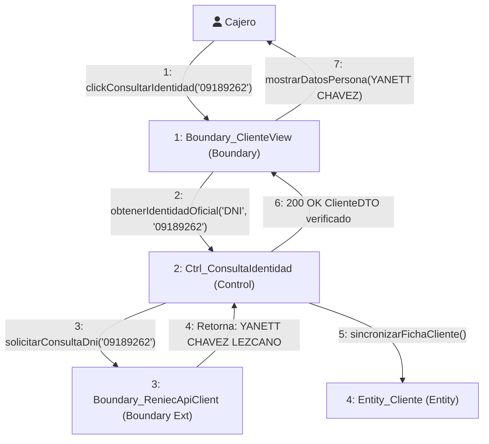
```mermaid
flowchart TD
    Cajero["fa:fa-user Cajero"]
    BoundaryView["1: Boundary_ClienteView (Boundary)"]
    ControlIdentidad["2: Ctrl_ConsultaIdentidad (Control)"]
    BoundaryExt["3: Boundary_ReniecApiClient (Boundary Ext)"]
    EntityCli["4: Entity_Cliente (Entity)"]

    Cajero -->|"1: clickConsultarIdentidad('09189262')"| BoundaryView
    BoundaryView -->|"2: obtenerIdentidadOficial('DNI', '09189262')"| ControlIdentidad
    ControlIdentidad -->|"3: solicitarConsultaDni('09189262')"| BoundaryExt
    BoundaryExt -->|"4: Retorna: YANETT CHAVEZ LEZCANO"| ControlIdentidad
    ControlIdentidad -->|"5: sincronizarFichaCliente()"| EntityCli
    ControlIdentidad -->|"6: 200 OK ClienteDTO verificado"| BoundaryView
    BoundaryView -->|"7: mostrarDatosPersona(YANETT CHAVEZ)"| Cajero
```

---

#### 4. Realización CUS-06: Emitir Nota de Crédito Electrónica y Reingreso de Stock

##### i. Diagrama de Clases de Análisis (Estilo Rhapsody)
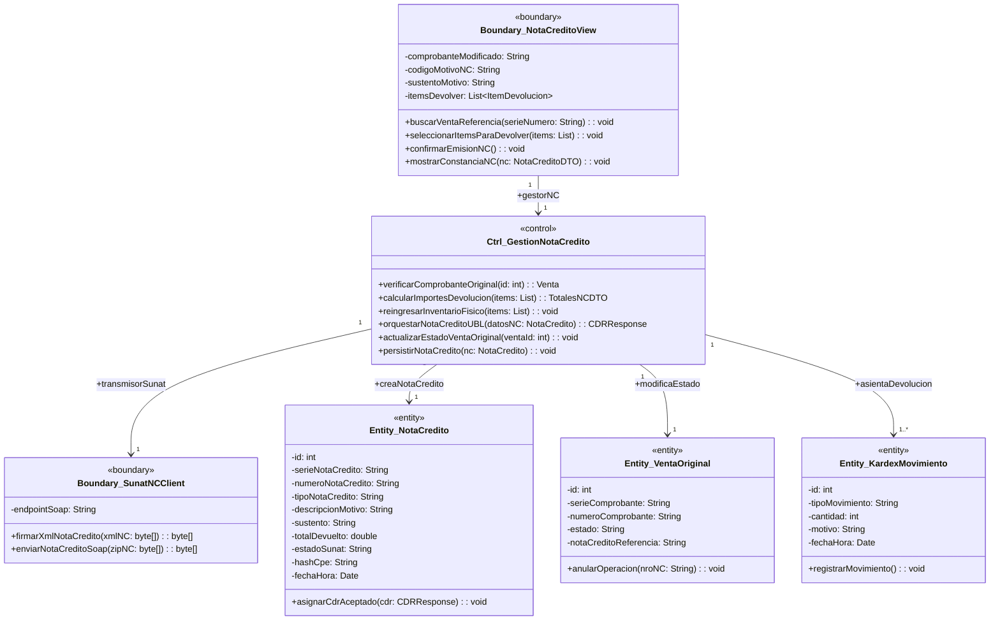
```mermaid
classDiagram
    class Boundary_NotaCreditoView <<boundary>> {
        -comprobanteModificado: String
        -codigoMotivoNC: String
        -sustentoMotivo: String
        -itemsDevolver: List~ItemDevolucion~
        +buscarVentaReferencia(serieNumero: String) : void
        +seleccionarItemsParaDevolver(items: List) : void
        +confirmarEmisionNC() : void
        +mostrarConstanciaNC(nc: NotaCreditoDTO) : void
    }

    class Boundary_SunatNCClient <<boundary>> {
        -endpointSoap: String
        +firmarXmlNotaCredito(xmlNC: byte[]) : byte[]
        +enviarNotaCreditoSoap(zipNC: byte[]) : byte[]
    }

    class Ctrl_GestionNotaCredito <<control>> {
        +verificarComprobanteOriginal(id: int) : Venta
        +calcularImportesDevolucion(items: List) : TotalesNCDTO
        +reingresarInventarioFisico(items: List) : void
        +orquestarNotaCreditoUBL(datosNC: NotaCredito) : CDRResponse
        +actualizarEstadoVentaOriginal(ventaId: int) : void
        +persistirNotaCredito(nc: NotaCredito) : void
    }

    class Entity_NotaCredito <<entity>> {
        -id: int
        -serieNotaCredito: String
        -numeroNotaCredito: String
        -tipoNotaCredito: String
        -descripcionMotivo: String
        -sustento: String
        -totalDevuelto: double
        -estadoSunat: String
        -hashCpe: String
        -fechaHora: Date
        +asignarCdrAceptado(cdr: CDRResponse) : void
    }

    class Entity_VentaOriginal <<entity>> {
        -id: int
        -serieComprobante: String
        -numeroComprobante: String
        -estado: String
        -notaCreditoReferencia: String
        +anularOperacion(nroNC: String) : void
    }

    class Entity_KardexMovimiento <<entity>> {
        -id: int
        -tipoMovimiento: String
        -cantidad: int
        -motivo: String
        -fechaHora: Date
        +registrarMovimiento() : void
    }

    Boundary_NotaCreditoView "1" --> "1" Ctrl_GestionNotaCredito : +gestorNC
    Ctrl_GestionNotaCredito "1" --> "1" Boundary_SunatNCClient : +transmisorSunat
    Ctrl_GestionNotaCredito "1" --> "1" Entity_NotaCredito : +creaNotaCredito
    Ctrl_GestionNotaCredito "1" --> "1" Entity_VentaOriginal : +modificaEstado
    Ctrl_GestionNotaCredito "1" --> "1..*" Entity_KardexMovimiento : +asientaDevolucion
```

##### ii. Diagrama de Comunicación
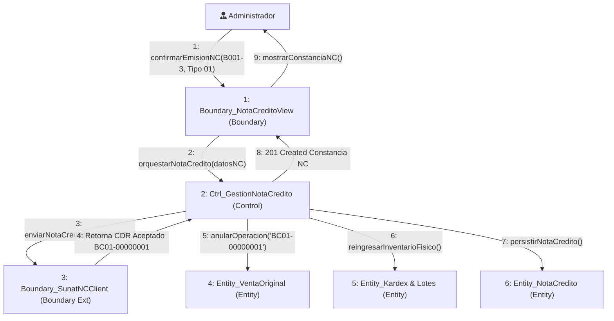
```mermaid
flowchart TD
    Admin["fa:fa-user-tie Administrador"]
    BoundaryNC["1: Boundary_NotaCreditoView (Boundary)"]
    CtrlNC["2: Ctrl_GestionNotaCredito (Control)"]
    SunatNC["3: Boundary_SunatNCClient (Boundary Ext)"]
    EntityVenta["4: Entity_VentaOriginal (Entity)"]
    EntityKardex["5: Entity_Kardex & Lotes (Entity)"]
    EntityNCJson["6: Entity_NotaCredito (Entity)"]

    Admin -->|"1: confirmarEmisionNC(B001-3, Tipo 01)"| BoundaryNC
    BoundaryNC -->|"2: orquestarNotaCredito(datosNC)"| CtrlNC
    CtrlNC -->|"3: enviarNotaCreditoSoap(xmlUBL)"| SunatNC
    SunatNC -->|"4: Retorna CDR Aceptado BC01-00000001"| CtrlNC
    CtrlNC -->|"5: anularOperacion('BC01-00000001')"| EntityVenta
    CtrlNC -->|"6: reingresarInventarioFisico()"| EntityKardex
    CtrlNC -->|"7: persistirNotaCredito()"| EntityNCJson
    CtrlNC -->|"8: 201 Created Constancia NC"| BoundaryNC
    BoundaryNC -->|"9: mostrarConstanciaNC()"| Admin
```

---

### [PARTICIPANTE 3]

#### 5. Realización CUS-07: Control de Stock y Semáforo FEFO

##### i. Diagrama de Clases de Análisis (Estilo Rhapsody)
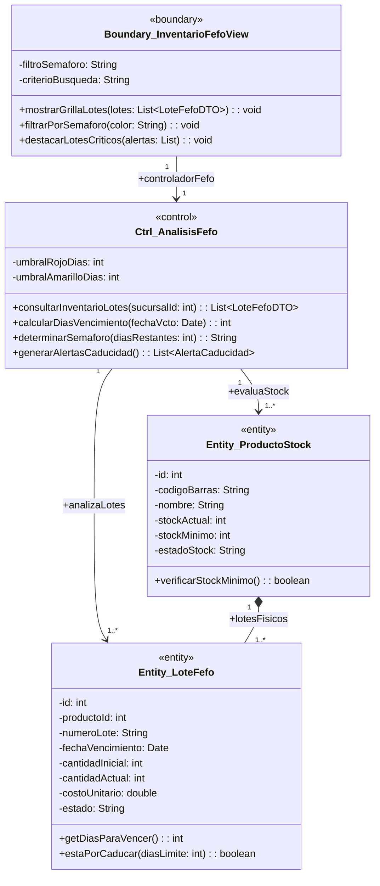
```mermaid
classDiagram
    class Boundary_InventarioFefoView <<boundary>> {
        -filtroSemaforo: String
        -criterioBusqueda: String
        +mostrarGrillaLotes(lotes: List~LoteFefoDTO~) : void
        +filtrarPorSemaforo(color: String) : void
        +destacarLotesCriticos(alertas: List) : void
    }

    class Ctrl_AnalisisFefo <<control>> {
        -umbralRojoDias: int
        -umbralAmarilloDias: int
        +consultarInventarioLotes(sucursalId: int) : List~LoteFefoDTO~
        +calcularDiasVencimiento(fechaVcto: Date) : int
        +determinarSemaforo(diasRestantes: int) : String
        +generarAlertasCaducidad() : List~AlertaCaducidad~
    }

    class Entity_ProductoStock <<entity>> {
        -id: int
        -codigoBarras: String
        -nombre: String
        -stockActual: int
        -stockMinimo: int
        -estadoStock: String
        +verificarStockMinimo() : boolean
    }

    class Entity_LoteFefo <<entity>> {
        -id: int
        -productoId: int
        -numeroLote: String
        -fechaVencimiento: Date
        -cantidadInicial: int
        -cantidadActual: int
        -costoUnitario: double
        -estado: String
        +getDiasParaVencer() : int
        +estaPorCaducar(diasLimite: int) : boolean
    }

    Boundary_InventarioFefoView "1" --> "1" Ctrl_AnalisisFefo : +controladorFefo
    Ctrl_AnalisisFefo "1" --> "1..*" Entity_ProductoStock : +evaluaStock
    Ctrl_AnalisisFefo "1" --> "1..*" Entity_LoteFefo : +analizaLotes
    Entity_ProductoStock "1" *-- "1..*" Entity_LoteFefo : +lotesFisicos
```

##### ii. Diagrama de Comunicación
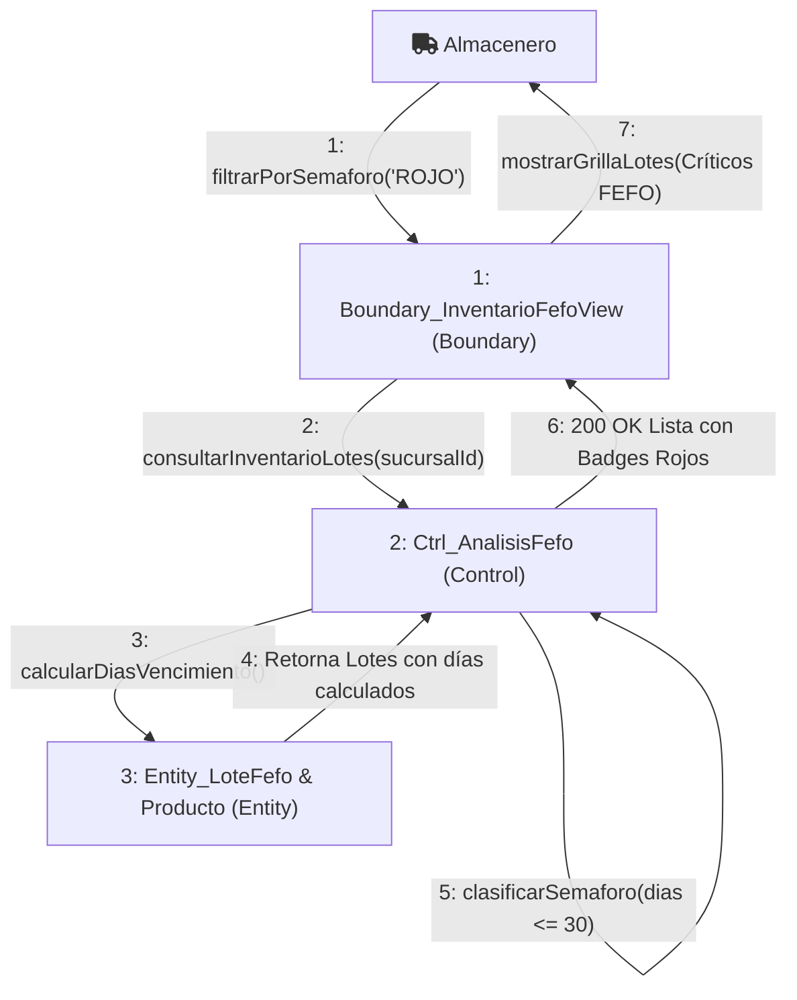
```mermaid
flowchart TD
    Almacenero["fa:fa-truck Almacenero"]
    BoundaryFefo["1: Boundary_InventarioFefoView (Boundary)"]
    CtrlFefo["2: Ctrl_AnalisisFefo (Control)"]
    EntityLotes["3: Entity_LoteFefo & Producto (Entity)"]

    Almacenero -->|"1: filtrarPorSemaforo('ROJO')"| BoundaryFefo
    BoundaryFefo -->|"2: consultarInventarioLotes(sucursalId)"| CtrlFefo
    CtrlFefo -->|"3: calcularDiasVencimiento()"| EntityLotes
    EntityLotes -->|"4: Retorna Lotes con días calculados"| CtrlFefo
    CtrlFefo -->|"5: clasificarSemaforo(dias <= 30)"| CtrlFefo
    CtrlFefo -->|"6: 200 OK Lista con Badges Rojos"| BoundaryFefo
    BoundaryFefo -->|"7: mostrarGrillaLotes(Críticos FEFO)"| Almacenero
```

---

#### 6. Realización CUS-08: Registrar Ingreso de Mercadería y Lotes de Compra

##### i. Diagrama de Clases de Análisis (Estilo Rhapsody)
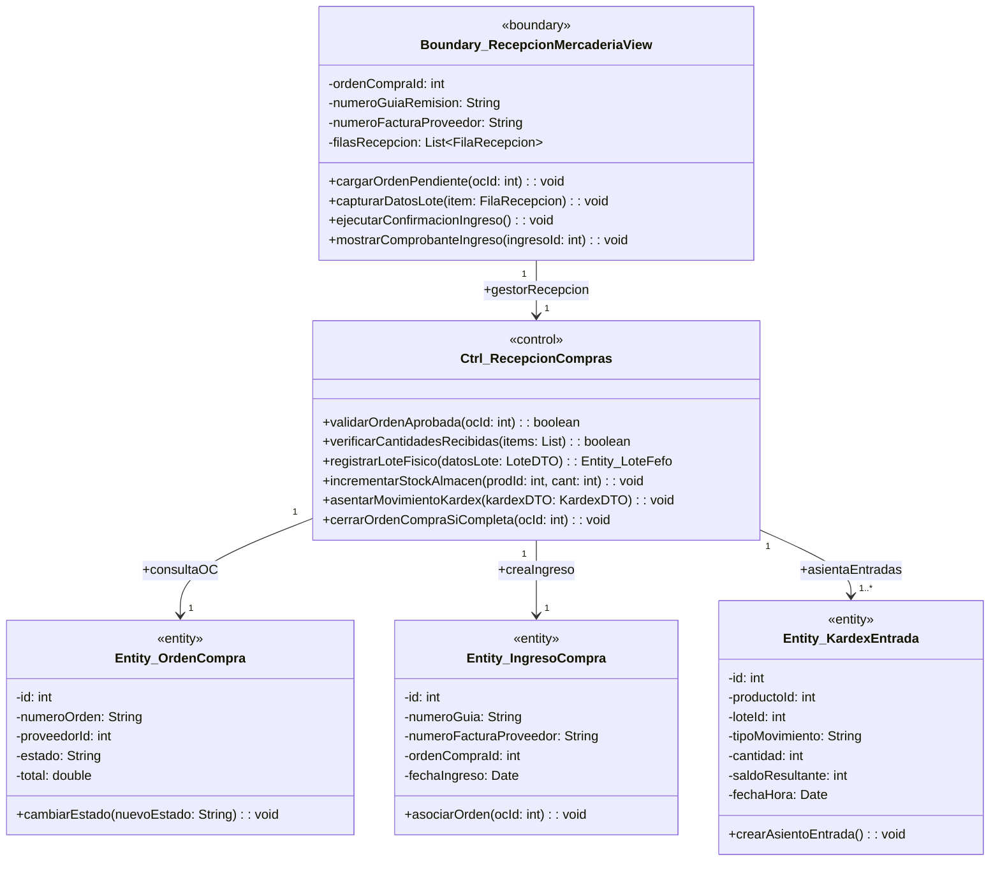
```mermaid
classDiagram
    class Boundary_RecepcionMercaderiaView <<boundary>> {
        -ordenCompraId: int
        -numeroGuiaRemision: String
        -numeroFacturaProveedor: String
        -filasRecepcion: List~FilaRecepcion~
        +cargarOrdenPendiente(ocId: int) : void
        +capturarDatosLote(item: FilaRecepcion) : void
        +ejecutarConfirmacionIngreso() : void
        +mostrarComprobanteIngreso(ingresoId: int) : void
    }

    class Ctrl_RecepcionCompras <<control>> {
        +validarOrdenAprobada(ocId: int) : boolean
        +verificarCantidadesRecibidas(items: List) : boolean
        +registrarLoteFisico(datosLote: LoteDTO) : Entity_LoteFefo
        +incrementarStockAlmacen(prodId: int, cant: int) : void
        +asentarMovimientoKardex(kardexDTO: KardexDTO) : void
        +cerrarOrdenCompraSiCompleta(ocId: int) : void
    }

    class Entity_OrdenCompra <<entity>> {
        -id: int
        -numeroOrden: String
        -proveedorId: int
        -estado: String
        -total: double
        +cambiarEstado(nuevoEstado: String) : void
    }

    class Entity_IngresoCompra <<entity>> {
        -id: int
        -numeroGuia: String
        -numeroFacturaProveedor: String
        -ordenCompraId: int
        -fechaIngreso: Date
        +asociarOrden(ocId: int) : void
    }

    class Entity_KardexEntrada <<entity>> {
        -id: int
        -productoId: int
        -loteId: int
        -tipoMovimiento: String
        -cantidad: int
        -saldoResultante: int
        -fechaHora: Date
        +crearAsientoEntrada() : void
    }

    Boundary_RecepcionMercaderiaView "1" --> "1" Ctrl_RecepcionCompras : +gestorRecepcion
    Ctrl_RecepcionCompras "1" --> "1" Entity_OrdenCompra : +consultaOC
    Ctrl_RecepcionCompras "1" --> "1" Entity_IngresoCompra : +creaIngreso
    Ctrl_RecepcionCompras "1" --> "1..*" Entity_KardexEntrada : +asientaEntradas
```

##### ii. Diagrama de Comunicación
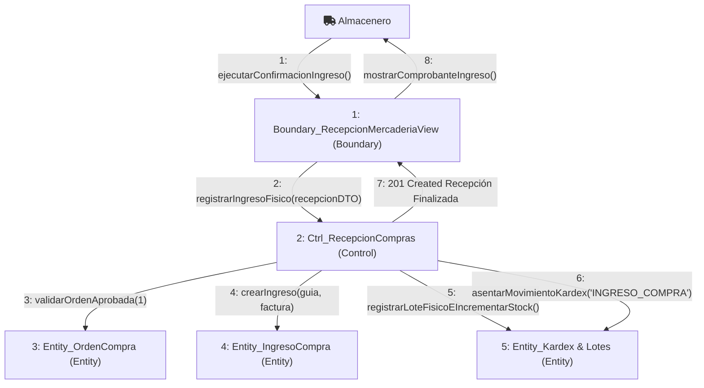
```mermaid
flowchart TD
    Almacenero["fa:fa-truck Almacenero"]
    BoundaryRec["1: Boundary_RecepcionMercaderiaView (Boundary)"]
    CtrlRec["2: Ctrl_RecepcionCompras (Control)"]
    EntityOC["3: Entity_OrdenCompra (Entity)"]
    EntityIngreso["4: Entity_IngresoCompra (Entity)"]
    EntityKardex["5: Entity_Kardex & Lotes (Entity)"]

    Almacenero -->|"1: ejecutarConfirmacionIngreso()"| BoundaryRec
    BoundaryRec -->|"2: registrarIngresoFisico(recepcionDTO)"| CtrlRec
    CtrlRec -->|"3: validarOrdenAprobada(1)"| EntityOC
    CtrlRec -->|"4: crearIngreso(guia, factura)"| EntityIngreso
    CtrlRec -->|"5: registrarLoteFisicoEIncrementarStock()"| EntityKardex
    CtrlRec -->|"6: asentarMovimientoKardex('INGRESO_COMPRA')"| EntityKardex
    CtrlRec -->|"7: 201 Created Recepción Finalizada"| BoundaryRec
    BoundaryRec -->|"8: mostrarComprobanteIngreso()"| Almacenero
```

---

### [PARTICIPANTE 4]

#### 7. Realización CUS-09: Gestionar Catálogo y Trazabilidad de Precios

##### i. Diagrama de Clases de Análisis (Estilo Rhapsody)
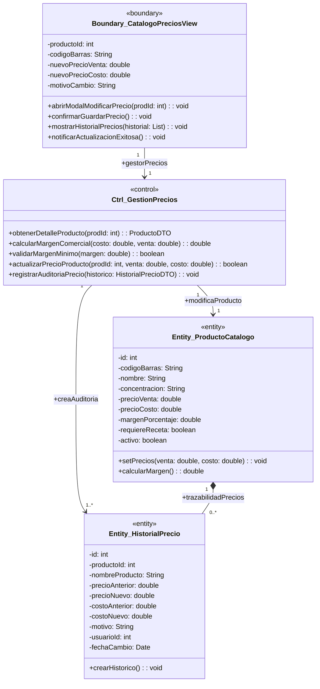
```mermaid
classDiagram
    class Boundary_CatalogoPreciosView <<boundary>> {
        -productoId: int
        -codigoBarras: String
        -nuevoPrecioVenta: double
        -nuevoPrecioCosto: double
        -motivoCambio: String
        +abrirModalModificarPrecio(prodId: int) : void
        +confirmarGuardarPrecio() : void
        +mostrarHistorialPrecios(historial: List) : void
        +notificarActualizacionExitosa() : void
    }

    class Ctrl_GestionPrecios <<control>> {
        +obtenerDetalleProducto(prodId: int) : ProductoDTO
        +calcularMargenComercial(costo: double, venta: double) : double
        +validarMargenMinimo(margen: double) : boolean
        +actualizarPrecioProducto(prodId: int, venta: double, costo: double) : boolean
        +registrarAuditoriaPrecio(historico: HistorialPrecioDTO) : void
    }

    class Entity_ProductoCatalogo <<entity>> {
        -id: int
        -codigoBarras: String
        -nombre: String
        -concentracion: String
        -precioVenta: double
        -precioCosto: double
        -margenPorcentaje: double
        -requiereReceta: boolean
        -activo: boolean
        +setPrecios(venta: double, costo: double) : void
        +calcularMargen() : double
    }

    class Entity_HistorialPrecio <<entity>> {
        -id: int
        -productoId: int
        -nombreProducto: String
        -precioAnterior: double
        -precioNuevo: double
        -costoAnterior: double
        -costoNuevo: double
        -motivo: String
        -usuarioId: int
        -fechaCambio: Date
        +crearHistorico() : void
    }

    Boundary_CatalogoPreciosView "1" --> "1" Ctrl_GestionPrecios : +gestorPrecios
    Ctrl_GestionPrecios "1" --> "1" Entity_ProductoCatalogo : +modificaProducto
    Ctrl_GestionPrecios "1" --> "1..*" Entity_HistorialPrecio : +creaAuditoria
    Entity_ProductoCatalogo "1" *-- "0..*" Entity_HistorialPrecio : +trazabilidadPrecios
```

##### ii. Diagrama de Comunicación
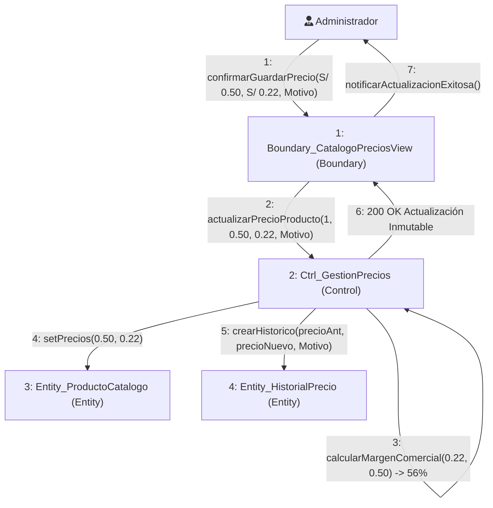
```mermaid
flowchart TD
    Admin["fa:fa-user-tie Administrador"]
    BoundaryCat["1: Boundary_CatalogoPreciosView (Boundary)"]
    CtrlPrecios["2: Ctrl_GestionPrecios (Control)"]
    EntityProd["3: Entity_ProductoCatalogo (Entity)"]
    EntityHist["4: Entity_HistorialPrecio (Entity)"]

    Admin -->|"1: confirmarGuardarPrecio(S/ 0.50, S/ 0.22, Motivo)"| BoundaryCat
    BoundaryCat -->|"2: actualizarPrecioProducto(1, 0.50, 0.22, Motivo)"| CtrlPrecios
    CtrlPrecios -->|"3: calcularMargenComercial(0.22, 0.50) -> 56%"| CtrlPrecios
    CtrlPrecios -->|"4: setPrecios(0.50, 0.22)"| EntityProd
    CtrlPrecios -->|"5: crearHistorico(precioAnt, precioNuevo, Motivo)"| EntityHist
    CtrlPrecios -->|"6: 200 OK Actualización Inmutable"| BoundaryCat
    BoundaryCat -->|"7: notificarActualizacionExitosa()"| Admin
```

---

#### 8. Realización CUS-10: Sincronizar y Generar Propuesta SIRE - RVIE SUNAT

##### i. Diagrama de Clases de Análisis (Estilo Rhapsody)
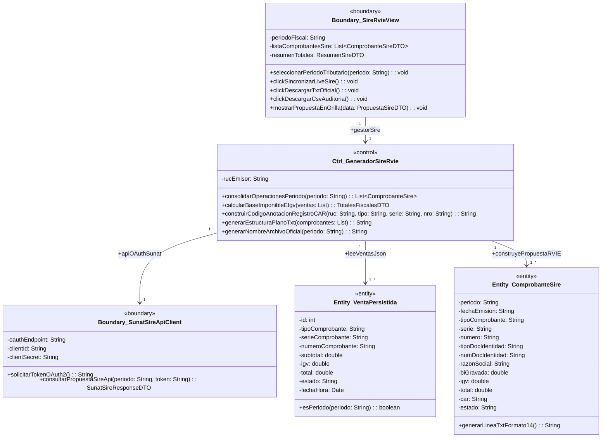
```mermaid
classDiagram
    class Boundary_SireRvieView <<boundary>> {
        -periodoFiscal: String
        -listaComprobantesSire: List~ComprobanteSireDTO~
        -resumenTotales: ResumenSireDTO
        +seleccionarPeriodoTributario(periodo: String) : void
        +clickSincronizarLiveSire() : void
        +clickDescargarTxtOficial() : void
        +clickDescargarCsvAuditoria() : void
        +mostrarPropuestaEnGrilla(data: PropuestaSireDTO) : void
    }

    class Boundary_SunatSireApiClient <<boundary>> {
        -oauthEndpoint: String
        -clientId: String
        -clientSecret: String
        +solicitarTokenOAuth2() : String
        +consultarPropuestaSireApi(periodo: String, token: String) : SunatSireResponseDTO
    }

    class Ctrl_GeneradorSireRvie <<control>> {
        -rucEmisor: String
        +consolidarOperacionesPeriodo(periodo: String) : List~ComprobanteSire~
        +calcularBaseImponibleEIgv(ventas: List) : TotalesFiscalesDTO
        +construirCodigoAnotacionRegistroCAR(ruc: String, tipo: String, serie: String, nro: String) : String
        +generarEstructuraPlanoTxt(comprobantes: List) : String
        +generarNombreArchivoOficial(periodo: String) : String
    }

    class Entity_VentaPersistida <<entity>> {
        -id: int
        -tipoComprobante: String
        -serieComprobante: String
        -numeroComprobante: String
        -subtotal: double
        -igv: double
        -total: double
        -estado: String
        -fechaHora: Date
        +esPeriodo(periodo: String) : boolean
    }

    class Entity_ComprobanteSire <<entity>> {
        -periodo: String
        -fechaEmision: String
        -tipoComprobante: String
        -serie: String
        -numero: String
        -tipoDocIdentidad: String
        -numDocIdentidad: String
        -razonSocial: String
        -biGravada: double
        -igv: double
        -total: double
        -car: String
        -estado: String
        +generarLineaTxtFormato14() : String
    }

    Boundary_SireRvieView "1" --> "1" Ctrl_GeneradorSireRvie : +gestorSire
    Ctrl_GeneradorSireRvie "1" --> "1" Boundary_SunatSireApiClient : +apiOAuthSunat
    Ctrl_GeneradorSireRvie "1" --> "1..*" Entity_VentaPersistida : +leeVentasJson
    Ctrl_GeneradorSireRvie "1" --> "1..*" Entity_ComprobanteSire : +construyePropuestaRVIE
```

##### ii. Diagrama de Comunicación
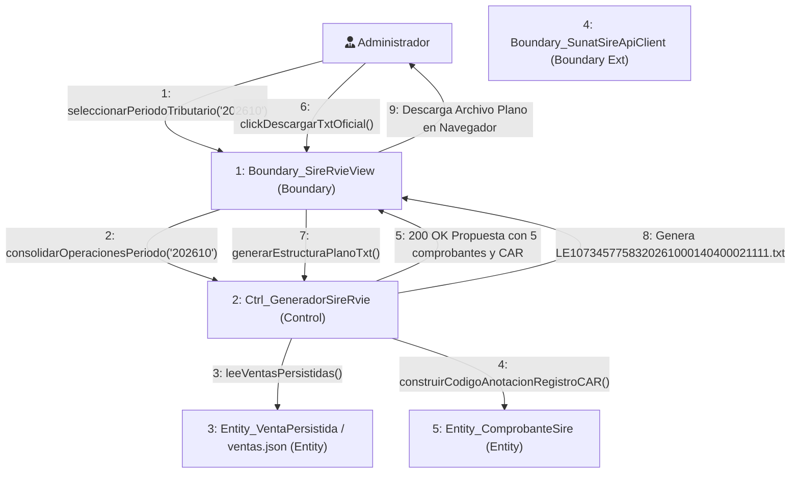
```mermaid
flowchart TD
    Admin["fa:fa-user-tie Administrador"]
    BoundarySire["1: Boundary_SireRvieView (Boundary)"]
    CtrlSire["2: Ctrl_GeneradorSireRvie (Control)"]
    VentasData["3: Entity_VentaPersistida / ventas.json (Entity)"]
    SunatApi["4: Boundary_SunatSireApiClient (Boundary Ext)"]
    EntitySire["5: Entity_ComprobanteSire (Entity)"]

    Admin -->|"1: seleccionarPeriodoTributario('202610')"| BoundarySire
    BoundarySire -->|"2: consolidarOperacionesPeriodo('202610')"| CtrlSire
    CtrlSire -->|"3: leeVentasPersistidas()"| VentasData
    CtrlSire -->|"4: construirCodigoAnotacionRegistroCAR()"| EntitySire
    CtrlSire -->|"5: 200 OK Propuesta con 5 comprobantes y CAR"| BoundarySire
    Admin -->|"6: clickDescargarTxtOficial()"| BoundarySire
    BoundarySire -->|"7: generarEstructuraPlanoTxt()"| CtrlSire
    CtrlSire -->|"8: Genera LE1073457758320261000140400021111.txt"| BoundarySire
    BoundarySire -->|"9: Descarga Archivo Plano en Navegador"| Admin
```

---

## C. Programación y Despliegue

### a. Realización de la Programación de los Casos de Uso Core

El sistema FarmaGest implementa una arquitectura multicapa desacoplada y modular:

```
┌────────────────────────────────────────────────────────┐
│             FRONTEND WEB (Angular 22)                 │
│  - Módulo POS con lector de código de barras           │
│  - Módulo Inventario con semáforo FEFO                 │
│  - Módulo Reportes SIRE (RVIE) con exportación TXT/CSV │
└───────────────────────────┬────────────────────────────┘
                            │ HTTP JSON (Puerto 4200 -> 8080)
┌───────────────────────────▼────────────────────────────┐
│            API GATEWAY (Node.js REST)                  │
│  - Control de turnos de caja y sesiones                │
│  - Persistencia automática atómica en disco            │
│  - Orquestador de emisión y propuesta fiscal           │
└──────────────┬──────────────────────────┬──────────────┘
               │                          │
┌──────────────▼─────────────┐ ┌──────────▼──────────────┐
│  PERSISTENCIA EN DISCO     │ │  MICROSERVICIO SUNAT     │
│  - backend/data/           │ │  - PHP 8.2 en puerto 8089│
│    ├── ventas.json         │ │  - Firma digital XML UBL │
│    └── notas_credito.json  │ │  - Cliente SOAP SUNAT    │
└────────────────────────────┘ └─────────────────────────┘
```

#### 1. Código Frontend: Servicio de Ventas y SIRE (`frontend/farmagest-web/src/app/core/services/ventas.service.ts`)
```typescript
@Injectable({ providedIn: 'root' })
export class VentasService {
  private apiUrl = 'http://localhost:8080/api/ventas';
  private sireUrl = 'http://localhost:8080/api/sire';

  constructor(private http: HttpClient) {}

  obtenerProximoCorrelativo(tipo: string): Observable<ProximoCorrelativoResponse> {
    return this.http.get<ProximoCorrelativoResponse>(`${this.apiUrl}/proximo-correlativo?tipo=${tipo}`);
  }

  registrarVenta(request: RegistrarVentaRequest): Observable<Venta> {
    return this.http.post<Venta>(this.apiUrl, request);
  }

  emitirNotaCredito(request: EmitirNotaCreditoRequest): Observable<NotaCredito> {
    return this.http.post<NotaCredito>(`${this.apiUrl}/notas-credito`, request);
  }

  obtenerPropuestaSire(periodo: string): Observable<SirePropuestaResponse> {
    return this.http.get<SirePropuestaResponse>(`${this.sireUrl}/rvie/propuesta?periodo=${periodo}`);
  }
}
```

#### 2. Código Backend Gateway: Persistencia Atómica en Disco (`backend/mock-server.js`)
```javascript
const DATA_DIR = path.join(__dirname, 'data');
const VENTAS_FILE = path.join(DATA_DIR, 'ventas.json');

function guardarVentas() {
  try {
    if (!fs.existsSync(DATA_DIR)) fs.mkdirSync(DATA_DIR, { recursive: true });
    fs.writeFileSync(VENTAS_FILE, JSON.stringify(VENTAS, null, 2), 'utf8');
    console.log(`[PERSISTENCIA] ${VENTAS.length} ventas guardadas en disco.`);
  } catch (err) {
    console.error('[PERSISTENCIA ERROR]', err.message);
  }
}

// Al recibir la venta en el endpoint POST /api/ventas:
VENTAS.unshift(nuevaVenta);
guardarVentas(); // Asegura que la venta y su correlativo nunca se pierdan
return sendJson(res, 201, nuevaVenta);
```

#### 3. Código Microservicio SUNAT: Generación y Firma UBL 2.1 (`backend/ms-sunat-php/src/SunatService.php`)
```php
public function emitirComprobante(array $datos): array {
    // 1. Construir documento estándar UBL 2.1 XML
    $xmlContent = $this->generarXmlUbl21(...);
    
    // 2. Firma digital mediante Certificado Digital Tributario
    $signer = new SignedXml();
    $signer->setCertificateFromFile($this->config['cert_path']);
    $xmlSigned = $signer->signFromFile($tempXmlPath);
    
    // 3. Envío al endpoint SOAP de SUNAT PRODUCCIÓN
    $zipData = $this->empaquetarZip($nombreArchivo . '.xml', $xmlSigned);
    $cdrZip = $this->enviarSoapSunat($nombreArchivo, $zipData);
    
    return [
        'estadoSunat' => 'ACEPTADA',
        'codigoRespuesta' => '0',
        'hashCpe' => $signer->getDigestValue(),
        'descripcion' => 'El comprobante ha sido aceptado por SUNAT'
    ];
}
```

---

### b. Despliegue de la Aplicación Web

#### 1. Repositorio Oficial en GitHub
* **URL del Proyecto:** [https://github.com/dadch1497/SistemaFarmacia](https://github.com/dadch1497/SistemaFarmacia)
* **Rama de Producción:** `main`
* **Integración Continua (CI):** GitHub Actions configurado con Node.js 22 LTS y validación automática de pruebas unitarias.

#### 2. Pasos para la Puesta en Marcha Local Unificada
1. Clonar el repositorio en cualquier máquina con Windows:
   ```bash
   git clone https://github.com/dadch1497/SistemaFarmacia.git
   cd SistemaFarmacia
   ```
2. Ejecutar el script automatizado:
   ```bash
   iniciar-farmagest.bat
   ```
3. El lanzador detecta los puertos libres e inicializa los servicios:
   * **Frontend Web:** [http://localhost:4200](http://localhost:4200)
   * **API Gateway & Persistencia:** [http://localhost:8080](http://localhost:8080)
   * **Microservicio Oficial SUNAT:** `http://127.0.0.1:8089`

#### 3. Alternativa de Despliegue en Servidor Cloud
* El frontend cuenta con build optimizado para producción (`npm run build`), compatible con despliegue instantáneo en plataformas como **Vercel** o **Firebase Hosting**.
* El backend cuenta con `Dockerfile` listo para correr en servicios de contenedores como **Render** o **Railway**.
